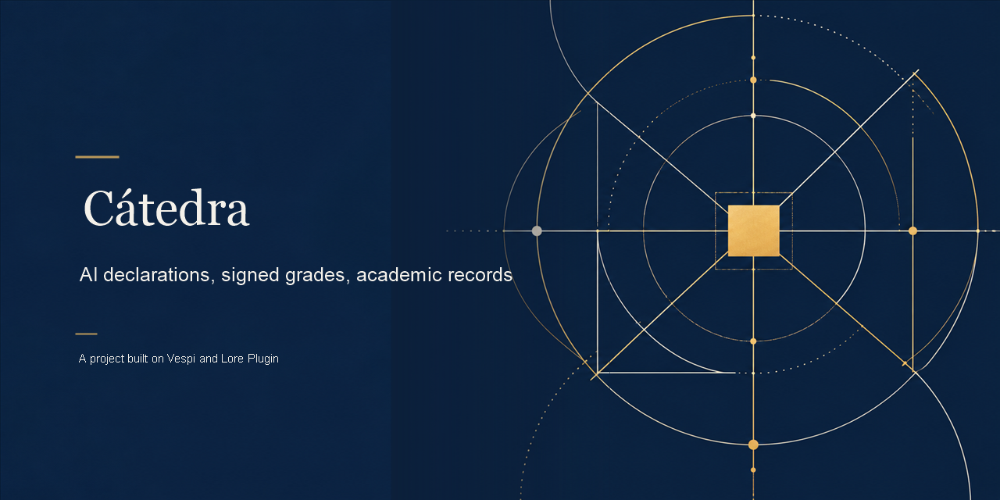

<p align="center">
  <a href="./assets/cover.png"></a>
</p>

<h1 align="center">Cátedra</h1>

<p align="center">
  <a href="#english"></a>
  <a href="./LICENSE"></a>
  <a href="./docs/EVIDENCE.md"></a>
  <a href="./docs/HOW_IT_WORKS.md"></a>
  <a href="https://github.com/andresanemic/vespi"></a>
  <a href="https://github.com/andresanemic/vespi/tree/ed559e83c976dd6e6a379a5510db776206f670b4"></a>
</p>

<p align="center"><b>Cátedra</b> — academic records are scattered and nobody can see who authorised what.<br>
Each academic act has an authority and a record anyone can check. Evidence: 36/36 tests. Fictional university and data.</p>

<p align="center"><b>We’re applying to the Find Your Way hackathon and plan to participate in Meridian.</b></p>
<p align="center"><b>For judges:</b> <a href="./docs/HOW_IT_WORKS.md">How it works</a> · <a href="./docs/EVIDENCE.md">Evidence</a> · <a href="./docs/LEGAL_AND_LIMITS.md">Limits</a> · <a href="./CODE_NOT_INCLUDED.md">Source and review terms</a>.<br>This public snapshot contains documentation and evidence, not runnable source.</p>

---

<details>
<summary><b>Read in English</b></summary>

<a id="english"></a>

**Cátedra follows an academic record from enrollment to a professor-signed grade and a degree, leaving a receipt at each institutional act.**

> **The unit is the institutional act and its receipt: who had authority, what happened, and what can be checked afterward.**

## Why this project exists

Enrollment, submitted work, declarations of AI use, grades, and degrees often sit in separate records. When a question comes later, the institution needs more than a row in a spreadsheet: it needs to explain who was allowed to perform an act, what the act recorded, and what another person can check without relying only on the program that produced it. Cátedra makes that question concrete through a fictional university and a short academic path.

The project explores a record in which permission changes with the act. A secretary may enroll a student while a call is open; enrollment in one course permits a submission to that course; the professor assigned to the course signs its grade; and a degree requires the professor and the degree office. Each operation leaves a local receipt. The receipt makes the event inspectable, but it does not turn an unanchored degree into an externally verifiable credential.

All people, courses, and institutional details are fictional. The project uses synthetic data and contains no real personal, health, financial, or third-party data.

## In one minute

Picture a student in a fictional course whose enrollment call is open. The secretary enrolls her under that call's limited authority, and the local record receives a receipt. The student submits her work to the same course and includes the required declaration of which AI tools she used and in what proportion. That declaration must be present and complete; Cátedra stores it but does not establish whether it is true.

The professor for that course reviews the submission and approves the grade through the human approval gate. If the grade needs correction, the original signed record stays in place and a replacement grade becomes a new record. Later, the professor and the degree office each approve the degree. A separate process can recalculate local receipt digests and record-line hashes without loading Cátedra. It can show whether those local inputs still match their recorded integrity values. It cannot establish who controlled the professor's local key or whether a university issued the degree outside this demonstration.

## What it looks like in practice

This is a **schematic dialogue**, not a transcript from the terminal and not a claim about literal program output. The bracketed roles and course are fictional placeholders. The decisions shown follow the agreement and the behaviors named in the captured suite.

```text
SECRETARY: The fictional course's enrollment call is open.
STUDENT: Enroll me in that course.
CÁTEDRA: The enrollment is allowed during the call and leaves a local receipt.

STUDENT: Submit my work with the required AI-use declaration.
CÁTEDRA: The declaration is required and recorded with the submission.
           Its truth is not checked.

PROFESSOR: Approve the grade for the course I teach.
CÁTEDRA: The grade goes through the human approval gate and is signed.
           A correction creates a replacement record; both remain.

PROFESSOR + DEGREE OFFICE: Approve the degree.
CÁTEDRA: Both approvals are required. The anchor remains pending.

INDEPENDENT PROCESS: Recompute the local receipt and record integrity.
REVIEWER: This checks the supplied local record. It does not prove an
          external university issued the degree.
```

The real suite names the boundaries this dialogue summarizes: `dentro de la convocatoria la matrícula sí pasa y deja recibo`, `entregar sin el campo de uso de IA completo también vuelve bloqueado, y dice qué falta`, `corregir una nota firmada se hace con otra nota que la sustituye, y quedan las dos`, and `el título exige dos firmas: con una sola no se emite`. The dialogue condenses those rules; it does not reproduce a run.

## How it works

```text
Secretary ── opens a time-limited enrollment call ── enrolls student
    │                                                │ receipt
    └──────────────── scoped authority ─────────────┘
                                                     ▼
Student ── submits course work + required AI-use declaration
                                                     │ receipt
                                                     ▼
Course professor ── human approval gate ── signs grade
                                                     │
                            correction = new grade; both records remain
                                                     ▼
Professor + degree office ── two approvals ── degree record
                                                     │ anchor: pending
                                                     ▼
Separate verifier ── recomputes local receipt and record integrity
```

The system performs an operation as an agent; it does not consent for a person. A Vespi grant scopes each act to its permitted action and destination. A grant does not inherit authority beyond what was explicitly given.

| Actor | Rights in the flow | Limit |
|---|---|---|
| University secretary | Opens an enrollment call and performs enrollment and institutional signing operations under scoped authority | Cannot consent for a professor or replace a required signature |
| Student | Enrolls in a course and submits work with the required AI-use declaration | Cannot sign a grade; the declaration's truth is not checked |
| Professor | Signs grades for the course they teach through the approval gate | A local key links the signature to content; it does not prove civil identity |
| Degree office | Provides the second required signature for a degree | One signature alone cannot issue the degree |
| Independent verifier | Recomputes what it can from record and receipt inputs | Checks local integrity, not identity, truth, authorship, or external issuance |
| Reader without Cátedra | Inspects the record and the verifier's result | Has no public anchor to check whether an outside university issued the degree |

## Why Cátedra

| You need | What it gives you | Where it lives |
|---|---|---|
| Enrollment tied to an open call | A scoped enrollment operation that is blocked before or after the call window | [How it works](./docs/HOW_IT_WORKS.md) |
| A course-specific submission record | Enrollment in that course is required, with the declared AI tools and proportion recorded | [How it works](./docs/HOW_IT_WORKS.md) |
| A grade signed by the assigned professor | A human approval gate and a cryptographic signature over grade content | [How it works](./docs/HOW_IT_WORKS.md) |
| A correction that preserves history | A replacement grade is added while the earlier signed grade remains | [How it works](./docs/HOW_IT_WORKS.md) |
| A degree that needs more than one approval | The professor and degree office must both approve issuance | [How it works](./docs/HOW_IT_WORKS.md) |
| A check independent of the application process | A separate process recomputes local receipt digests and record-line hashes | [Evidence](./docs/EVIDENCE.md) |
| A clear account of open limits | Test results, adversarial findings, and what the integrity check cannot prove | [Evidence](./docs/EVIDENCE.md) · [Legal and limits](./docs/LEGAL_AND_LIMITS.md) |

## What Cátedra is not

Cátedra is a fictional university intranet and a demonstrated path through a small set of academic acts. It is not a learning management system, a complete academic registry, or a service for a real institution. It does not verify the truth of AI-use declarations, establish a signer's civil identity, or provide an externally verifiable degree. It does not connect to a university, a blockchain, a payment service, or a testnet.

## Evidence you can open

The captured suite has 36 tests: 36 pass, 0 fail, 0 skipped, 0 TODO, on Node v24.15.0. It ran in a clean clone with empty HOME and no network against Vespi kernel **0.1.5 release** (commit `ed559e83c976dd6e6a379a5510db776206f670b4`), vendored in the project and checked module by module against its SOURCE.md. The 2026-10-03 capture was red because the project was then pinned to the old kernel cut 0.1.3 (`54c20c7`); that re-pin is done. The tests cover enrollment windows, course permissions, required declarations, approval boundaries, grade replacement, two-signature degree issuance, altered records and receipts, terminal behavior, and a separate verifier. [Evidence](./docs/EVIDENCE.md) preserves the test names and adversarial findings.

This is a working path, not a finished product or evidence of readiness for institutional use. The degree anchor is `pending`: there is no testnet hash, transaction ID, or public explorer entry to inspect. The verifier can recalculate integrity from local inputs; the professor's private key is stored beside the record in this demonstration, so its signature links content to a key and does not establish identity.

## Cátedra, Vespi, and Lore Plugin

Cátedra consumes the Vespi kernel without modifying it. In this project, Vespi supplies scoped grants, the human signer gate, and receipt operations whose digest Cátedra uses for local verification. The adversarial test also records a limit of that boundary: the kernel gate counts a supplied signer name, not an authenticated key. Cátedra's separate cryptographic layer rejects an invalid signature, but the kernel receipt may still retain the supplied name.

**What this relationship means.** The project was built with Lore Plugin's method (its agreement and criterion live in the project, in `acuerdo.md` and `lore/`), and its operations, authority and receipts run on the Vespi kernel 0.1.5, in the pinned copy that Lore Plugin 2.5.1 distributes (`skills/vespi/core/kernel`). That copy sits in the project as `vendor/vespi-kernel` and the suite verifies it against its `SOURCE.md`. Lore Plugin does not run inside the project. This project does not use the kernel's newer capabilities (Stellar pubnet anchors, live x402 settlement, the ZK verifier, emergency access); it exercises the core of operations, authority and receipts.

Lore Plugin supplies the project context and criteria that guide the work; it is not the runtime that records enrollment or issues a grade. The division is practical: project criteria shape the agreed path, while the Vespi kernel handles scoped operations and receipts. Neither makes the pending degree anchor public or proves an external issuance. See [How it works](./docs/HOW_IT_WORKS.md) for the integration boundary.

## What is not done or verified

The project does not verify that an AI-use declaration is true, that the professor's key belongs to the named person, or that an outside university issued a degree. It does not claim compliance with any law. The agreement mentions Chile's Law 21.719 as a concern illustrated by the project, but says the primary legal text was not reviewed and the implementation was not checked against it. No competent legal review is reported. The fictional university has no claimed adoption, permission, or affiliation with a real institution or third party. The kernel is pinned to **0.1.5 release** (`ed559e8`) and checked by the captured suite. [Legal and limits](./docs/LEGAL_AND_LIMITS.md) gives the full boundary.

## How to review this project

This public repository contains the project documentation and evidence, not its source code. The code is planned to open during the judges' review period under the review-only terms in [LICENSE](./LICENSE). For now, follow [How it works](./docs/HOW_IT_WORKS.md), compare its claims with [Evidence](./docs/EVIDENCE.md), read [Legal and limits](./docs/LEGAL_AND_LIMITS.md), and review the publication conditions in [Code not included](./CODE_NOT_INCLUDED.md).

## Author

**Andrés Peña**, repository authority: `andresanemic`.

[](https://t.me/andresanemic) &nbsp;&nbsp; [<picture><source media="(prefers-color-scheme: dark)" srcset="./assets/icons/v2/x-dark.svg"></picture>](https://x.com/andresanemic) &nbsp;&nbsp; [](https://www.linkedin.com/in/andresanemic/)

---

[How it works](./docs/HOW_IT_WORKS.md) · [Evidence](./docs/EVIDENCE.md) · [Legal and limits](./docs/LEGAL_AND_LIMITS.md) · [Code not included](./CODE_NOT_INCLUDED.md) · [Review-only license](./LICENSE) · [Vespi](https://github.com/andresanemic/vespi) · [Lore Plugin](https://github.com/andresanemic/lore-plugin)

</details>

<details>
<summary><b>Leer en español</b></summary>

<a id="espanol"></a>

**Cátedra recorre un registro académico desde la matrícula hasta una nota firmada por el profesor y un título, dejando un recibo en cada acto institucional.**

> **La unidad es el acto institucional y su recibo: quién tenía autoridad, qué ocurrió y qué puede comprobarse después.**

## Por qué existe este proyecto

La matrícula, los trabajos, las declaraciones de uso de IA, las notas y los títulos suelen estar en registros separados. Cuando surge una pregunta después, la institución necesita algo más que una fila en una planilla: necesita explicar quién podía realizar un acto, qué quedó registrado y qué puede comprobar otra persona sin depender únicamente del programa que produjo ese registro. Cátedra vuelve concreta esa pregunta mediante una universidad ficticia y un recorrido académico acotado.

El proyecto explora un registro donde el permiso depende del acto. Una secretaria puede matricular a una estudiante mientras una convocatoria está abierta; la matrícula en una asignatura permite entregar en esa asignatura; el profesor a cargo firma la nota; y para emitir un título se necesitan el profesor y la oficina de títulos. Cada operación deja un recibo local. El recibo permite inspeccionar lo ocurrido, pero no convierte un título sin anclaje en una credencial verificable desde afuera.

Todas las personas, asignaturas y características institucionales son de fantasía. El proyecto usa datos sintéticos y no contiene datos reales personales, de salud, financieros ni de terceros.

## Si estás evaluando Find Your Way o Meridian, empieza aquí

- Lee la base del proyecto y su recorrido. Empieza por [Cómo funciona](./docs/HOW_IT_WORKS.md).
- Abre el registro de pruebas. Consulta [Evidencia](./docs/EVIDENCE.md).
- Lee los límites jurídicos y de verificación. Consulta [Marco legal y límites](./docs/LEGAL_AND_LIMITS.md).
- Revisa las condiciones de publicación. Consulta [Código no incluido](./CODE_NOT_INCLUDED.md) y la [licencia de solo revisión](./LICENSE).

## En un minuto

Imagina a una estudiante de una asignatura ficticia cuya convocatoria de matrícula está abierta. La secretaria la matricula bajo la autoridad acotada de esa convocatoria y el registro local recibe un comprobante. La estudiante entrega su trabajo en esa misma asignatura e incluye la declaración requerida sobre qué herramientas de IA usó y en qué proporción. La declaración debe estar presente y completa; Cátedra la guarda, pero no determina si es verdadera.

El profesor de esa asignatura revisa la entrega y aprueba la nota por la compuerta de aprobación humana. Si hay que corregirla, el registro firmado original se conserva y se añade una nota sustituta como registro nuevo. Más adelante, el profesor y la oficina de títulos aprueban el título. Un proceso separado puede recalcular los digests de los recibos locales y las huellas de las líneas del registro sin cargar Cátedra. Puede mostrar si esos datos locales aún coinciden con sus valores de integridad. No puede establecer quién controlaba la clave local del profesor ni si una universidad emitió el título fuera de esta demostración.

## Cómo se ve en la práctica

Este es un **diálogo esquemático**, no una transcripción de la terminal ni una afirmación sobre la salida literal del programa. Los roles y la asignatura entre corchetes son marcadores ficticios. Las decisiones siguen el acuerdo y los comportamientos descritos por los nombres de la suite capturada.

```text
SECRETARIA: La convocatoria de la asignatura ficticia está abierta.
ESTUDIANTE: Matricúlame en esa asignatura.
CÁTEDRA: La matrícula se permite durante la convocatoria y deja un recibo local.

ESTUDIANTE: Entrega mi trabajo con la declaración de uso de IA requerida.
CÁTEDRA: La declaración se exige y queda registrada con la entrega.
         No se comprueba si es verdadera.

PROFESOR: Apruebo la nota de la asignatura que imparto.
CÁTEDRA: La nota pasa por la compuerta de aprobación humana y queda firmada.
         Una corrección crea otro registro; ambos se conservan.

PROFESOR + OFICINA DE TÍTULOS: Aprobamos el título.
CÁTEDRA: Se requieren ambas aprobaciones. El anclaje sigue pendiente.

PROCESO INDEPENDIENTE: Recalcula la integridad del recibo y el registro local.
LECTOR: Comprueba estos datos locales. No prueba que una universidad externa
        haya emitido el título.
```

La suite real nombra los límites que resume el diálogo: `dentro de la convocatoria la matrícula sí pasa y deja recibo`, `entregar sin el campo de uso de IA completo también vuelve bloqueado, y dice qué falta`, `corregir una nota firmada se hace con otra nota que la sustituye, y quedan las dos`, y `el título exige dos firmas: con una sola no se emite`. El diálogo condensa esas reglas; no reproduce una ejecución.

## Cómo funciona

```text
Secretaria ── abre convocatoria con plazo ── matricula a la estudiante
    │                                        │ recibo
    └──────────── autoridad acotada ─────────┘
                                             ▼
Estudiante ── entrega trabajo + declaración requerida de uso de IA
                                             │ recibo
                                             ▼
Profesor de la asignatura ── compuerta humana ── firma la nota
                                             │
                  corrección = nota nueva; quedan ambos registros
                                             ▼
Profesor + oficina de títulos ── dos firmas ── registro del título
                                             │ anclaje: pending
                                             ▼
Verificador aparte ── recalcula la integridad de recibos y registro local
```

El sistema ejecuta una operación como agente; no consiente por una persona. Cada acto usa una autorización de Vespi acotada a la acción y al destino permitidos. Una autorización no hereda más atribuciones que las concedidas de forma explícita.

| Actor | Derechos en el recorrido | Límite |
|---|---|---|
| Secretaria de la universidad | Abre la convocatoria y ejecuta matrícula y operaciones institucionales de firma con autoridad acotada | No puede consentir por un profesor ni reemplazar una firma requerida |
| Estudiante | Se matricula y entrega trabajo con la declaración de uso de IA requerida | No puede firmar la nota; no se comprueba la verdad de la declaración |
| Profesor | Firma notas de la asignatura que imparte por la compuerta de aprobación | Una clave local vincula la firma con el contenido; no demuestra identidad civil |
| Oficina de títulos | Proporciona la segunda firma requerida para un título | Una sola firma no basta para emitirlo |
| Verificador independiente | Recalcula lo que puede a partir del registro y los recibos | Comprueba integridad local, no identidad, veracidad, autoría ni emisión externa |
| Lector sin Cátedra | Inspecciona el registro y el resultado del verificador | No dispone de un anclaje público para comprobar una emisión universitaria externa |

## Por qué Cátedra

| Necesitas | Qué te da | Dónde está |
|---|---|---|
| Una matrícula ligada a una convocatoria abierta | Una operación de matrícula acotada que se bloquea antes o después del plazo | [Cómo funciona](./docs/HOW_IT_WORKS.md) |
| Una entrega vinculada a su asignatura | Se requiere matrícula en esa asignatura y se registra qué IA se declaró y en qué proporción | [Cómo funciona](./docs/HOW_IT_WORKS.md) |
| Una nota firmada por el profesor asignado | Una compuerta de aprobación humana y una firma criptográfica sobre el contenido | [Cómo funciona](./docs/HOW_IT_WORKS.md) |
| Una corrección que conserve el historial | Se agrega una nota sustituta y se mantiene la nota firmada anterior | [Cómo funciona](./docs/HOW_IT_WORKS.md) |
| Un título que requiera más de una aprobación | El profesor y la oficina de títulos deben aprobar la emisión | [Cómo funciona](./docs/HOW_IT_WORKS.md) |
| Una comprobación independiente del proceso de la aplicación | Otro proceso recalcula digests de recibos y huellas de las líneas del registro | [Evidencia](./docs/EVIDENCE.md) |
| Una explicación clara de los límites abiertos | Resultados de pruebas, hallazgos adversariales y lo que no demuestra el control de integridad | [Evidencia](./docs/EVIDENCE.md) · [Marco legal y límites](./docs/LEGAL_AND_LIMITS.md) |

## Lo que Cátedra no es

Cátedra es una intranet universitaria ficticia y una demostración de un recorrido breve por algunos actos académicos. No es un sistema de gestión del aprendizaje, un registro académico completo ni un servicio para una institución real. No comprueba la veracidad de las declaraciones de uso de IA, no establece la identidad civil de quien firma ni ofrece un título verificable desde afuera. No se conecta con una universidad, una blockchain, un servicio de pagos ni una testnet.

## Evidencia que puedes abrir

La suite capturada tiene 36 pruebas: 36 pasan, 0 fallan, 0 omitidas, 0 TODO, en Node v24.15.0. Corrió en un clon limpio con HOME vacío y sin red contra el kernel Vespi **0.1.5 publicado** (commit `ed559e83c976dd6e6a379a5510db776206f670b4`), vendorizado en el proyecto y comprobado módulo por módulo contra su SOURCE.md. La captura del 2026-10-03 estaba en rojo porque el proyecto estaba fijado al corte viejo 0.1.3 (`54c20c7`); ese re-pin ya está hecho. Las pruebas cubren plazos de matrícula, permisos por asignatura, declaraciones requeridas, límites de aprobación, sustitución de notas, emisión de títulos con dos firmas, alteraciones de registros y recibos, comportamiento de la terminal y un verificador separado. [Evidencia](./docs/EVIDENCE.md) conserva los nombres de las pruebas y los hallazgos adversariales.

Esto es un recorrido funcional, no un producto terminado ni una prueba de preparación para uso institucional. El anclaje del título está en `pending`: no hay hash de testnet, identificador de transacción ni entrada en un explorador público. El verificador puede recalcular la integridad con datos locales; en esta demostración la clave privada del profesor está junto al registro, por lo que su firma vincula contenido con una clave, pero no establece identidad.

## Cátedra, Vespi y Lore Plugin

Cátedra consume el kernel de Vespi sin modificarlo. En este proyecto, Vespi proporciona autorizaciones acotadas, la compuerta de firmantes humanos y operaciones de recibo cuyo digest Cátedra utiliza en la comprobación local. La prueba adversarial también registra un límite de esa frontera: la compuerta del kernel cuenta el nombre de firmante que se proporciona, no una clave autenticada. La capa criptográfica separada de Cátedra rechaza una firma inválida, pero el recibo del kernel puede conservar el nombre suministrado.

**Qué significa esta relación.** El proyecto se construyó con el método de Lore Plugin (su acuerdo y su criterio viven en el proyecto, en `acuerdo.md` y `lore/`), y sus operaciones, autoridad y recibos corren sobre el kernel de Vespi 0.1.5, en la copia fijada que distribuye Lore Plugin 2.5.1 (`skills/vespi/core/kernel`). Esa copia está en el proyecto como `vendor/vespi-kernel` y la suite la verifica contra su `SOURCE.md`. Lore Plugin no corre dentro del proyecto. Este proyecto no usa las capacidades nuevas del kernel (anclas Stellar pubnet, liquidación x402 en vivo, el verificador ZK, el acceso de emergencia); ejerce el núcleo de operaciones, autoridad y recibos.

Lore Plugin aporta el contexto y los criterios de proyecto que guían el trabajo; no es el sistema que registra matrículas ni firma notas. La división es concreta: los criterios de proyecto orientan el recorrido acordado, mientras el kernel de Vespi gestiona operaciones acotadas y recibos. Ninguno vuelve público el anclaje pendiente ni prueba una emisión externa. [Cómo funciona](./docs/HOW_IT_WORKS.md) explica la frontera de integración.

## Lo que no está hecho ni verificado

El proyecto no verifica que una declaración de uso de IA sea verdadera, que la clave del profesor pertenezca a la persona nombrada ni que una universidad externa haya emitido un título. No afirma cumplir ninguna ley. El acuerdo menciona la Ley 21.719 de Chile como una preocupación que el proyecto ilustra, pero indica que no se revisó el texto legal primario ni se contrastó la implementación con él. No consta una revisión jurídica competente. La universidad ficticia no reclama adopción, permiso ni afiliación con una institución real o un tercero. El kernel está fijado al **0.1.5 publicado** (`ed559e8`) y comprobado por la suite capturada. [Marco legal y límites](./docs/LEGAL_AND_LIMITS.md) desarrolla estas fronteras.

## Cómo revisar este proyecto

Este repositorio público contiene la documentación y la evidencia del proyecto, no su código fuente. Está previsto abrir el código durante el periodo de revisión de los jueces bajo las condiciones de solo revisión de [LICENSE](./LICENSE). Por ahora, sigue [Cómo funciona](./docs/HOW_IT_WORKS.md), contrasta sus afirmaciones con [Evidencia](./docs/EVIDENCE.md), lee [Marco legal y límites](./docs/LEGAL_AND_LIMITS.md) y revisa las condiciones de publicación en [Código no incluido](./CODE_NOT_INCLUDED.md).

## Autor

**Andrés Peña**, autoridad del repositorio: `andresanemic`.

[](https://t.me/andresanemic) &nbsp;&nbsp; [<picture><source media="(prefers-color-scheme: dark)" srcset="./assets/icons/v2/x-dark.svg"></picture>](https://x.com/andresanemic) &nbsp;&nbsp; [](https://www.linkedin.com/in/andresanemic/)

---

[Cómo funciona](./docs/HOW_IT_WORKS.md) · [Evidencia](./docs/EVIDENCE.md) · [Marco legal y límites](./docs/LEGAL_AND_LIMITS.md) · [Código no incluido](./CODE_NOT_INCLUDED.md) · [Licencia de solo revisión](./LICENSE) · [Vespi](https://github.com/andresanemic/vespi) · [Lore Plugin](https://github.com/andresanemic/lore-plugin)

</details>
